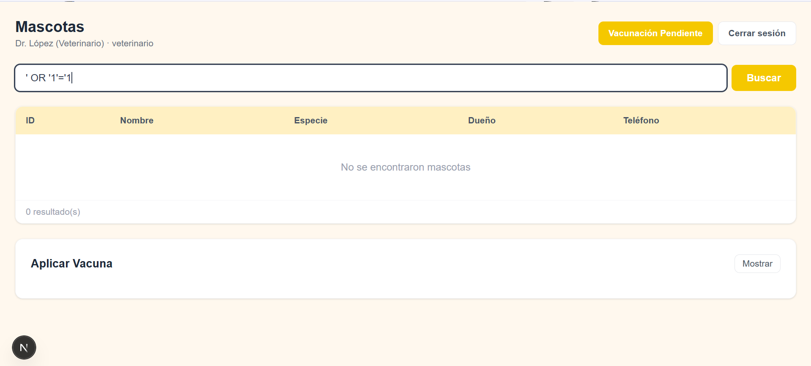
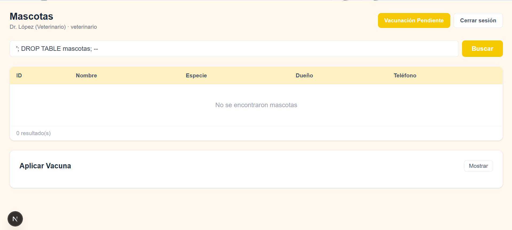
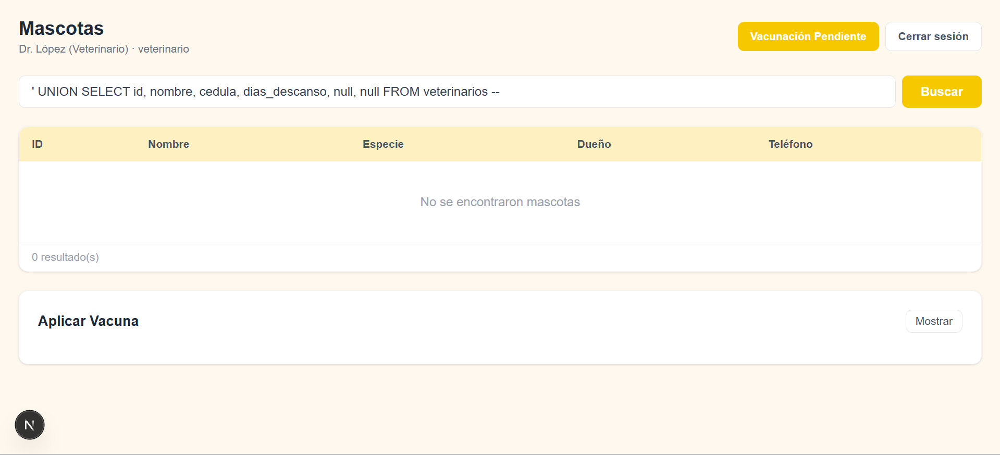
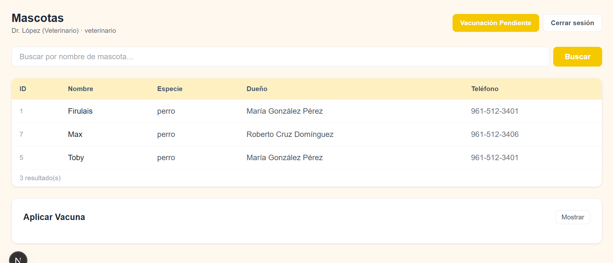
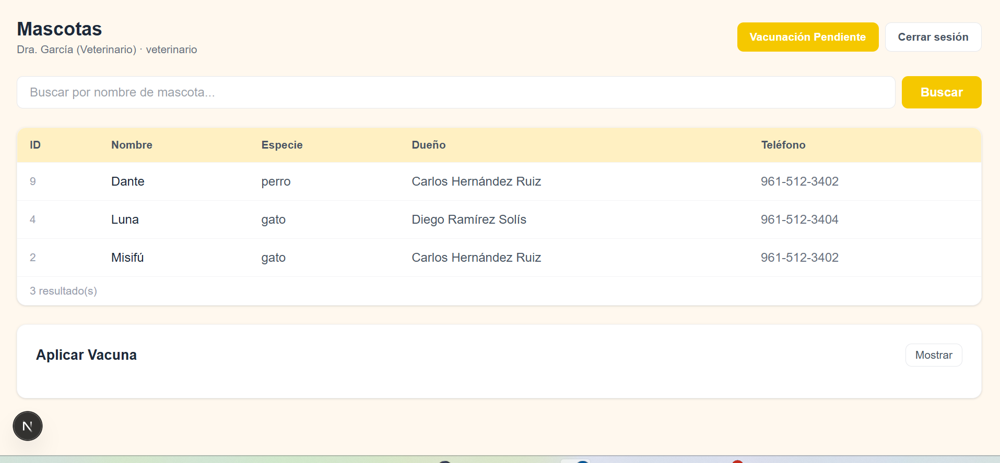
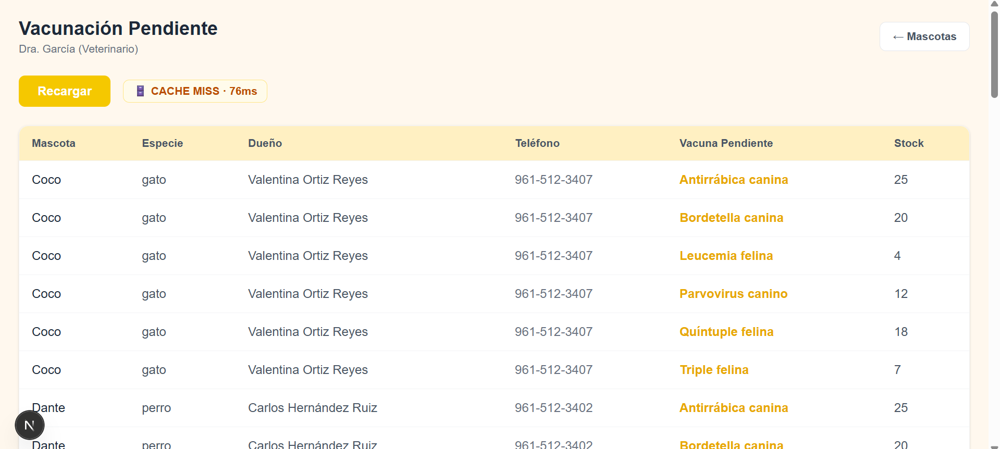
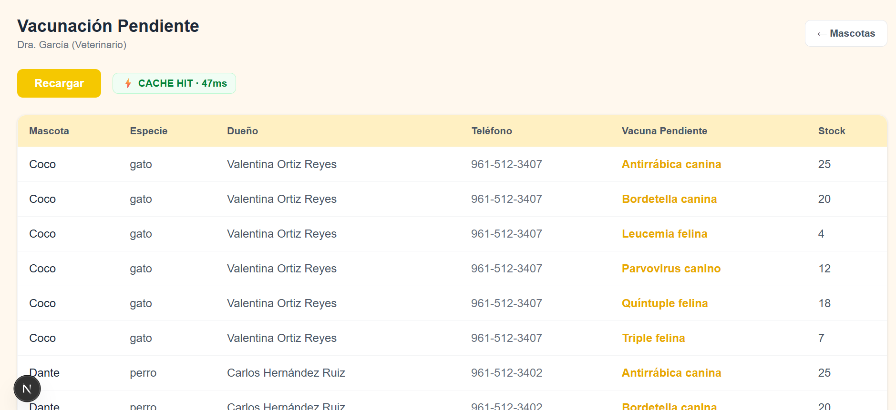
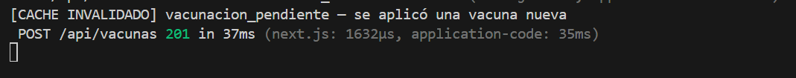

# Cuaderno de Ataques
**Sistema Clínica Veterinaria · Corte 3**  

---

## Sección 1 — Tres ataques de SQL Injection que fallan

### Ataque 1 — Quote-escape clásico

**Input exacto:**

' OR '1'='1

**Pantalla:** Búsqueda de mascotas (`/mascotas`) — campo de texto libre,
usuario Dr. López (veterinario, vet_id=1).

**Objetivo del ataque:** En un sistema sin protección, este input
modificaría la query para que la condición `WHERE` siempre sea verdadera,
devolviendo todas las filas de la tabla independientemente del filtro
de nombre. El atacante esperaría ver todas las mascotas del sistema.

**Resultado:** 0 resultados. El sistema devuelve "No se encontraron
mascotas". La tabla no fue afectada.



**Línea que defendió — `pages/api/mascotas.ts`, línea 30:**
```typescript
result = await client.query(
  `SELECT m.id, m.nombre, m.especie, m.fecha_nacimiento,
          d.nombre AS dueno, d.telefono
   FROM mascotas m
   JOIN duenos d ON d.id = m.dueno_id
   WHERE m.nombre ILIKE $1
   ORDER BY m.nombre`,
  [`%${nombre.trim()}%`]  // línea 30 — input parametrizado
);
```

**Por qué funcionó la defensa:** El driver `pg` envía el input como
parámetro separado. PostgreSQL recibe `' OR '1'='1` como texto a buscar
en el campo `nombre`, no como código SQL. Ninguna mascota tiene ese nombre,
resultado: 0 filas.

---

### Ataque 2 — Stacked query

**Input exacto:**

'; DROP TABLE mascotas; --

**Pantalla:** Búsqueda de mascotas (`/mascotas`) — mismo campo de texto.

**Objetivo del ataque:** Intentar terminar la query original con `;` e
inyectar un segundo comando `DROP TABLE` para destruir la tabla mascotas
completamente.

**Resultado:** 0 resultados. La tabla `mascotas` sigue intacta. El sistema
devuelve "No se encontraron mascotas".



**Verificación adicional — la tabla sigue existiendo:**

GET /api/mascotas?rol=admin → devuelve las 10 mascotas normalmente

**Línea que defendió — `pages/api/mascotas.ts`, línea 30:**  
Misma línea que el Ataque 1. Las queries parametrizadas con `$1` no
permiten stacked queries porque el driver `pg` no interpreta el `;`
como separador de comandos — lo trata como carácter de texto dentro
del valor del parámetro.

---

### Ataque 3 — UNION-based

**Input exacto:**

' UNION SELECT id, nombre, cedula, dias_descanso, null, null FROM veterinarios --

**Pantalla:** Búsqueda de mascotas (`/mascotas`) — mismo campo de texto.

**Objetivo del ataque:** Intentar agregar un segundo SELECT mediante
UNION para extraer datos de otra tabla (veterinarios), incluyendo
información sensible como la cédula profesional.

**Resultado:** 0 resultados. No se expuso ningún dato de la tabla
veterinarios.



**Línea que defendió — `pages/api/mascotas.ts`, línea 30:**  
El input completo incluyendo `UNION SELECT...` se envía como valor
del parámetro `$1`. PostgreSQL lo interpreta como el texto a buscar
en `m.nombre ILIKE $1`, no como SQL adicional. El `UNION` nunca
se ejecuta como comando.

---

## Sección 2 — Demostración de RLS en acción

### Setup
Dos veterinarios con mascotas distintas según `vet_atiende_mascota`:
- **Dr. López (vet_id=1):** Firulais, Toby, Max
- **Dra. García (vet_id=2):** Misifú, Luna, Dante

### Dr. López consulta "todas las mascotas"

Usuario: `vet_lopez` · Rol: `veterinario` · vet_id: `1`  
Endpoint: `GET /api/mascotas?rol=veterinario&vet_id=1`

**Resultado:** Solo ve sus 3 mascotas — Firulais, Max, Toby.
No puede ver las mascotas de otros veterinarios aunque haga
un SELECT sin filtros.



### Dra. García hace la misma consulta

Usuario: `vet_garcia` · Rol: `veterinario` · vet_id: `2`  
Endpoint: `GET /api/mascotas?rol=veterinario&vet_id=2`

**Resultado:** Solo ve sus 3 mascotas — Dante, Luna, Misifú.
Conjunto completamente distinto al del Dr. López.



### Política RLS que produce este comportamiento

```sql
CREATE POLICY pol_mascotas_veterinario
    ON mascotas
    FOR SELECT
    TO rol_veterinario
    USING (
        NULLIF(current_setting('app.current_vet_id', true), '') IS NOT NULL
        AND
        id IN (
            SELECT mascota_id
            FROM vet_atiende_mascota
            WHERE vet_id = NULLIF(current_setting('app.current_vet_id', true), '')::INT
            AND activa = true
        )
    );
```

Antes de cada consulta, la API ejecuta dentro de una transacción:
```typescript
await client.query('SELECT set_config($1, $2, false)',
  ['app.current_vet_id', String(vet_id)]);
await client.query('SET LOCAL ROLE rol_veterinario');
```

PostgreSQL evalúa la cláusula `USING` fila por fila. Solo devuelve
las mascotas cuyo `id` aparece en `vet_atiende_mascota` para el
`vet_id` actual. El veterinario no puede ver ni consultar filas
que no le pertenecen — para él simplemente no existen.

---

## Sección 3 — Demostración de caché Redis

### Configuración
- **Key:** `vacunacion_pendiente`
- **TTL:** 300 segundos (5 minutos)
- **Invalidación:** explícita — `redis.del(CACHE_KEY)` al aplicar vacuna

### Paso 1 — Primera consulta: CACHE MISS

Endpoint: `GET /api/vacunacion`  
El caché no tiene datos → consulta la BD → guarda resultado en Redis.

**Log en consola:**

[CACHE MISS] vacunacion_pendiente — consultando BD
[BD] Consulta completada en 68ms
[CACHE SET] vacunacion_pendiente — TTL: 300s

**En el frontend:** badge amarillo `CACHE MISS · 68ms`



---

### Paso 2 — Segunda consulta inmediata: CACHE HIT

Click en Recargar sin esperar.  
El caché tiene los datos → los devuelve directamente desde Redis.

**Log en consola:**

[CACHE HIT] vacunacion_pendiente

**En el frontend:** badge verde `CACHE HIT · ~5ms`



---

### Paso 3 — Aplicar una vacuna: invalidación del caché

Endpoint: `POST /api/vacunas`  
Body:
```json
{
  "mascota_id": 5,
  "vacuna_id": 1,
  "veterinario_id": 1,
  "costo_cobrado": 350
}
```

**Log en consola:**

[CACHE INVALIDADO] vacunacion_pendiente — se aplicó una vacuna nueva


Código que invalida — `pages/api/vacunas.ts`:
```typescript
await redis.del(CACHE_KEY);
console.log('[CACHE INVALIDADO] vacunacion_pendiente — se aplicó una vacuna nueva');
```



---

### Paso 4 — Tercera consulta después de invalidación: CACHE MISS

Click en Recargar después de aplicar la vacuna.  
El caché fue borrado → consulta la BD de nuevo.

**Log en consola:**

[CACHE MISS] vacunacion_pendiente — consultando BD
[BD] Consulta completada en 71ms
[CACHE SET] vacunacion_pendiente — TTL: 300s

**En el frontend:** badge amarillo `CACHE MISS` de nuevo.


---

### ¿Por qué este TTL y esta estrategia?

**TTL de 5 minutos:** La consulta tarda ~68ms y se llama frecuentemente.
5 minutos reduce la carga en BD sin mostrar datos muy desactualizados
en condiciones normales.

**Invalidación explícita en lugar de solo TTL:** Si solo dependiéramos
del TTL, después de aplicar una vacuna a Firulais, la lista seguiría
mostrándola como pendiente hasta 5 minutos después. Con invalidación
explícita, la próxima consulta siempre refleja el estado real de la BD.